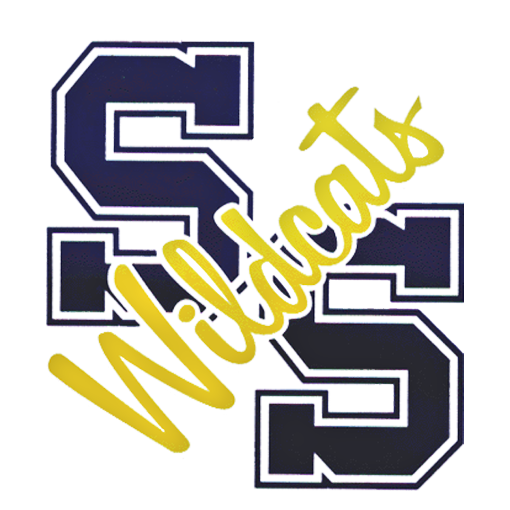

## Welcome to Sulphur Springs High School Robotics Github

<a src="http://www.ssisd.net"></a>

### Markdown

Markdown is a lightweight and easy-to-use syntax for styling your writing. It includes conventions for

```markdown
Syntax highlighted code block

# Header 1
## Header 2
### Header 3

- Bulleted
- List

1. Numbered
2. List

**Bold** and _Italic_ and `Code` text

[Link](url) and 
```


### Jekyll Themes


Your Pages site will use the layout and styles from the Jekyll theme you have selected in your [repository settings](https://github.com/SulphurSpringsHS/Website/settings/pages). The name of this theme is saved in the Jekyll `_config.yml` configuration file.

### Support or Contact
Email SSHS Coach with any questions/concerns :: jwilder@ssisd.net

Want to see some more of our projects?  Reach out via email and we can forward you a short descript email of what we're currently working on.

### Robotics and Automation Techology
# This is a link to the Skills USA page of all the competitions that we competed in.  We were unable to compete due to the weather. 
[Robotics and Automation Techology](https://www.skillsusa.org/competitions/skillsusa-championships/contest-descriptions/)
<!-- What is this?  Put more information that ties this in to what we're doing.  We're creating a repo of all of our work and resources -->
